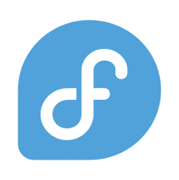

# Senior Developer status: Loading... [█▒▒▒▒▒▒▒▒▒▒▒▒▒] 5%. Soon to be your lead's most reliable asset. 🔒
## 🌱 Currently learning
| Tech Stack | Icon | Repository |
| :--- | :--- | :--- |
| **GitHub** |  | You can find more information about my progress in (link)
| **Fedora** |  | You can find more information about my progress in (link)
| **c#** | X | You can find more information about my progress in (link)
| **.NET** | X | You can find more information about my progress in (link)
| **MySQL** | X | You can find more information about my progress in (link)

<!--
**M1nguS1/M1nguS1** is a ✨ _special_ ✨ repository because its `README.md` (this file) appears on your GitHub profile.

Here are some ideas to get you started:

- 🔭 I’m currently working on ...
- 🌱 I’m currently learning ...
- 👯 I’m looking to collaborate on ...
- 🤔 I’m looking for help with ...
- 💬 Ask me about ...
- 📫 How to reach me: ...
- 😄 Pronouns: ...
- ⚡ Fun fact: ...
-->
